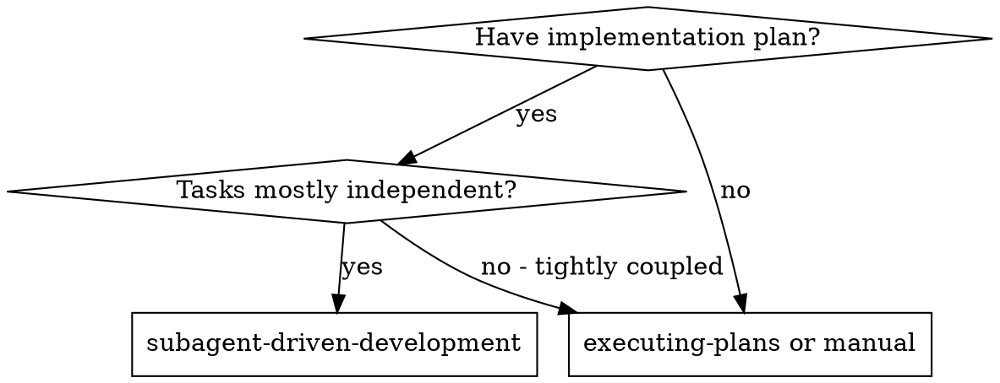
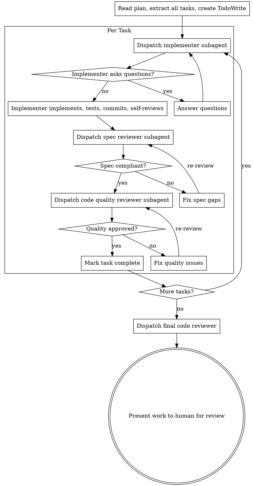

# Subagent-Driven Development

Execute plan by dispatching fresh subagent per task, with two-stage review after each: spec compliance review first, then code quality review.

**Why subagents:** Fresh context per task, no context pollution, precisely crafted instructions. They should never inherit your session's context or history — you construct exactly what they need.

**Core principle:** Fresh subagent per task + two-stage review (spec then quality) = high quality, fast iteration

## When to Use

## The Process

## Model Selection

Use the least powerful model that can handle each role to conserve cost and increase speed.

- **Mechanical tasks** (isolated functions, clear specs, 1-2 files): cheap model
- **Integration tasks** (multi-file, pattern matching): standard model
- **Architecture, design, review**: most capable model

## Handling Implementer Status

**DONE:** Proceed to spec compliance review.

**DONE_WITH_CONCERNS:** Read the concerns before proceeding. If about correctness/scope, address first. If observations only, note and proceed.

**NEEDS_CONTEXT:** Provide the missing context and re-dispatch.

**BLOCKED:** Assess the blocker:
1. Context problem → provide more context, re-dispatch
2. Needs more reasoning → re-dispatch with more capable model
3. Task too large → break into smaller pieces
4. Plan wrong → escalate to human

Never ignore an escalation or force the same model to retry without changes.

## Prompt Templates

- `./implementer-prompt.md` - Dispatch implementer subagent
- `./spec-reviewer-prompt.md` - Dispatch spec compliance reviewer subagent
- `./code-quality-reviewer-prompt.md` - Dispatch code quality reviewer subagent

## Red Flags

**Never:**
- Start implementation on main/master branch without explicit user consent
- Skip reviews (spec compliance OR code quality)
- Proceed with unfixed issues
- Dispatch multiple implementation subagents in parallel (conflicts)
- Make subagent read plan file (provide full text instead)
- Skip scene-setting context
- Ignore subagent questions (answer before letting them proceed)
- Accept "close enough" on spec compliance
- Skip review loops (reviewer found issues = implementer fixes = review again)
- Let implementer self-review replace actual review
- **Start code quality review before spec compliance is ✅**
- Move to next task while either review has open issues

## Integration

**Required workflow skills:**
- **superpowers:writing-plans** - Creates the plan this skill executes
- **superpowers:requesting-code-review** - Code review template for reviewer subagents

**Subagents should use:**
- **superpowers:test-driven-development** - Subagents follow TDD for each task
- **superpowers:verification-before-completion** - Before claiming work is done
