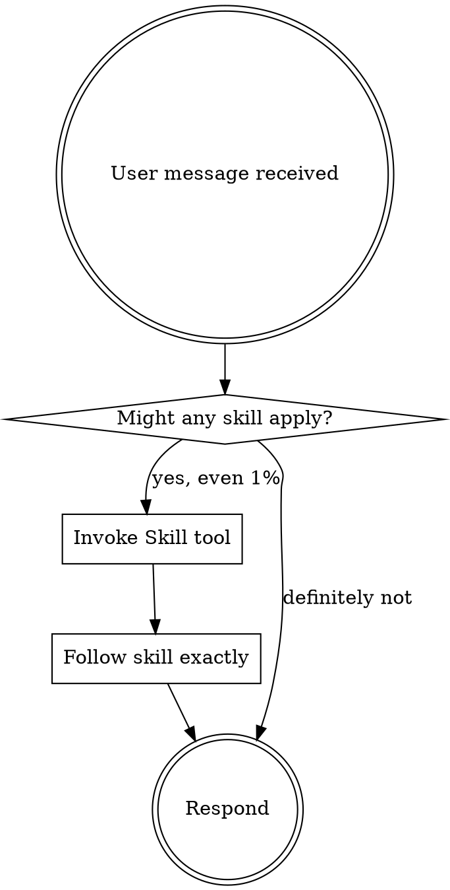

<SUBAGENT-STOP>
If you were dispatched as a subagent to execute a specific task, skip this skill.
</SUBAGENT-STOP>

<EXTREMELY-IMPORTANT>
If you think there is even a 1% chance a skill might apply to what you are doing, you ABSOLUTELY MUST invoke the skill.

IF A SKILL APPLIES TO YOUR TASK, YOU DO NOT HAVE A CHOICE. YOU MUST USE IT.

This is not negotiable. This is not optional. You cannot rationalize your way out of this.
</EXTREMELY-IMPORTANT>

## Instruction Priority

1. **User's explicit instructions** (CLAUDE.md, direct requests) — highest priority
2. **Mini-skills** — override default system behavior where they conflict
3. **Default system prompt** — lowest priority

## The Rule

**Invoke relevant skills BEFORE any response or action.** Even a 1% chance a skill might apply means you must invoke it to check. If an invoked skill turns out to be wrong for the situation, you don't need to follow it.

## Available Skills

| Trigger | Skill |
|---------|-------|
| About to build, add, or modify any feature | `brainstorming` |
| Have a spec/design and need an implementation plan | `writing-plans` |
| Have a plan and need to execute it with subagents | `subagent-driven-development` |
| About to claim work is complete, tests pass, or bug is fixed | `verification-before-completion` |
| Writing new tests or new production code | `test-driven-development` |
| Completing a task, after a major feature, before merge | `requesting-code-review` |

## Skill Priority

1. **Process skills first** (brainstorming, debugging) — these determine HOW to approach the task
2. **Implementation skills second** — these guide execution

"Let's build X" → `brainstorming` first, then `writing-plans`, then `subagent-driven-development`.

## Red Flags

These thoughts mean STOP — you're rationalizing:

| Thought | Reality |
|---------|---------|
| "This is just a simple question" | Questions are tasks. Check for skills. |
| "I need more context first" | Skill check comes BEFORE clarifying questions. |
| "Let me explore the codebase first" | Skills tell you HOW to explore. Check first. |
| "This doesn't need a formal skill" | If a skill exists, use it. |
| "I remember this skill" | Skills evolve. Read current version. |
| "The skill is overkill" | Simple things become complex. Use it. |
| "I'll just do this one thing first" | Check BEFORE doing anything. |
| "I know what that means" | Knowing the concept ≠ using the skill. Invoke it. |
